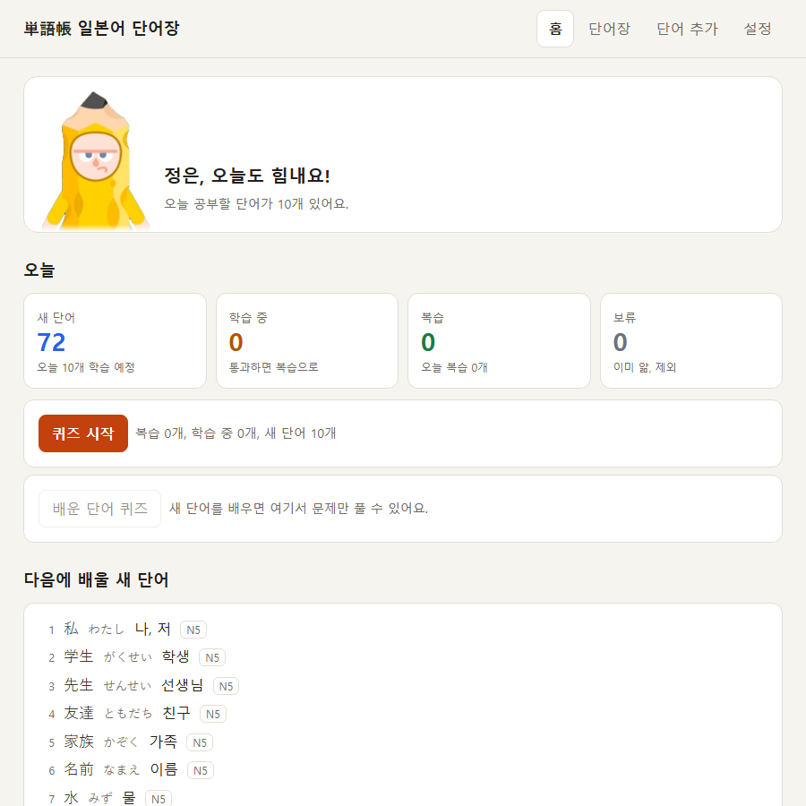
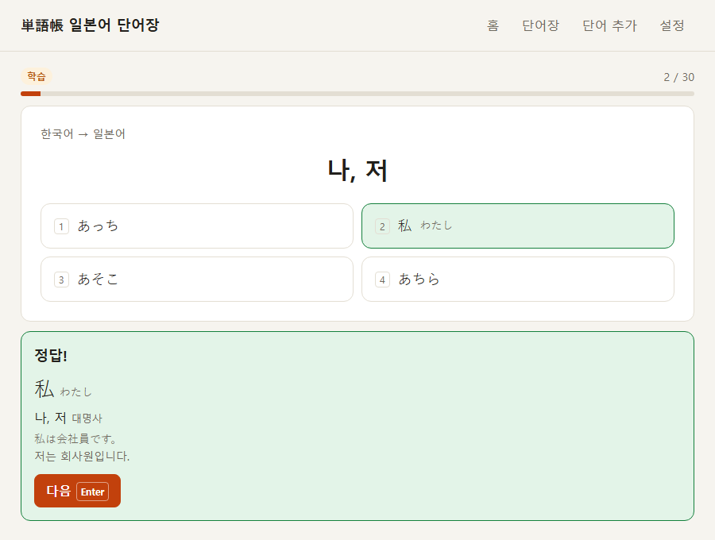

# 일본어 단어장

공부한 일본어 단어를 매일 퀴즈로 외우는 단어장입니다.
HTML 파일 하나로 동작하고, 설치할 것이 없습니다.

 

## 받기

**[단어장.html 받기](https://github.com/devdongin/WordForJungEun/raw/main/app/%EB%8B%A8%EC%96%B4%EC%9E%A5.html)**

1. 위 링크를 누르면 파일이 받아지거나 코드가 화면에 보입니다.
2. 코드가 보이면 화면에서 마우스 오른쪽 버튼을 누르고 **다른 이름으로 저장**을 고릅니다. 파일 이름은 `단어장.html` 그대로 둡니다.
3. 받은 파일을 더블클릭하면 브라우저에서 열립니다.

[파일 페이지](https://github.com/devdongin/WordForJungEun/blob/main/app/%EB%8B%A8%EC%96%B4%EC%9E%A5.html)의 다운로드 버튼으로 받아도 됩니다.

- 크롬, 엣지, 웨일 최신 버전에서 동작합니다.
- 인터넷에 연결돼 있어야 단어를 받아옵니다.
- 파일 하나만 있으면 됩니다. 다른 폴더는 필요 없습니다.

## 사용 가이드

### 1. 처음 열기

파일을 열면 GitHub에서 단어를 자동으로 받아옵니다.
받은 단어는 모두 **새 단어** 상태로 시작합니다.

홈 화면에는 단어가 상태별로 나옵니다.

| 상태 | 뜻 |
|---|---|
| 새 단어 | 아직 배우지 않은 단어 |
| 학습 중 | 오늘 배우기 시작했지만 아직 통과하지 못한 단어 |
| 복습 | 통과해서 정해진 날짜에 다시 나오는 단어 |
| 보류 | "이미 앎"으로 뺀 단어 |

### 2. 퀴즈 시작: 매일 하는 공부

홈에서 **퀴즈 시작**을 누릅니다. 오늘 할 일이 한 번에 나옵니다.

1. **복습**: 복습 날짜가 된 단어를 먼저 풉니다.
2. **새 단어**: 단어 카드를 보고 **익혔어요**를 누르면 바로 문제가 나옵니다. 하루에 10개씩 배웁니다.
3. **결과**: 몇 문제 맞혔는지, 복습으로 넘어간 단어와 틀린 단어가 나옵니다.

새 단어가 복습으로 넘어가는 조건은 이렇습니다.
- 한국어 → 일본어, 일본어 → 한국어 문제를 각각 한 번 이상 맞힙니다.
- 마지막 두 문제를 연속으로 맞힙니다.
- 틀리면 같은 단어가 조금 뒤에 다시 나옵니다.

복습으로 넘어간 단어는 다음 날 처음 복습합니다. 그 뒤로는 맞힐 때마다 간격이 길어집니다.

| 맞힌 횟수 | 1번 | 2번 | 3번 | 4번 | 5번 | 6번부터 |
|---|---|---|---|---|---|---|
| 다음 복습 | 3일 뒤 | 7일 뒤 | 14일 뒤 | 30일 뒤 | 60일 뒤 | 60일 뒤 |

- 복습에서 틀리면 다음 날 다시 나옵니다.
- 복습에서 두 번 연속 틀리면 **학습 중**으로 돌아가 다시 배웁니다.

### 3. 문제 유형

| 유형 | 문제 | 답 |
|---|---|---|
| 한국어 → 일본어 | 한국어 뜻 | 일본어 4개 중 고르기 |
| 일본어 → 한국어 | 일본어 단어 | 한국어 뜻 4개 중 고르기 |
| 뜻 쓰기 | 일본어 단어 | 한국어 뜻 직접 입력 (복습에서만 나옴) |

뜻 쓰기 채점 규칙은 이렇습니다.
- 띄어쓰기와 "~하다", "~함" 같은 끝말은 신경 쓰지 않습니다. "공부하다"와 "공부"는 같은 답입니다.
- 작은 오타는 자동으로 정답입니다. 정답 화면에 올바른 철자가 같이 나옵니다.
- 두 글자 이하인 뜻은 오타를 인정하지 않습니다. "공부"와 "공무"는 다른 단어이기 때문입니다.
- 채점이 틀렸다고 생각되면 **내 답도 맞음**을 누르세요. 그 답은 다음부터 정답으로 칩니다.

키보드로도 풀 수 있습니다.
- 숫자 `1`~`4`: 보기 고르기
- `Enter`: 다음 문제
- **읽기 보기**: 일본어 문제에서 읽는 법 보기

모르는 문제는 **모르겠어요**를 누르면 정답을 보여줍니다.

### 4. 배운 단어 퀴즈

홈의 **배운 단어 퀴즈**는 학습 중이거나 복습 상태인 단어에서만 문제를 무작위로 냅니다.
새 단어 카드 없이 문제만 풀고 싶을 때 씁니다.

- 기본 10문제이고, 설정에서 바꿀 수 있습니다.
- 여기서 푼 결과는 복습 날짜를 바꾸지 않습니다. 몇 번을 풀어도 괜찮습니다.
- 끝나면 **틀린 단어 다시 풀기**나 **새 문제로 한 번 더**를 누를 수 있습니다.

### 5. 단어장

위쪽 **단어장** 메뉴에서 모든 단어를 봅니다.

- 한자, 읽기, 뜻으로 검색합니다.
- 상태나 태그로 걸러 봅니다.
- 이미 아는 단어는 **이미 앎**을 누르면 퀴즈에서 빠집니다. **보류 해제**를 누르면 다시 나옵니다.
- 홈 화면의 상태 칸을 누르면 그 상태의 단어만 모아 봅니다.

### 6. 단어 직접 추가

위쪽 **단어 추가** 메뉴에서 교재나 드라마에서 본 단어를 넣습니다.
직접 추가한 단어는 새 단어 중에서 **가장 먼저** 배웁니다.

- **하나씩 추가**: 읽기와 한국어 뜻은 꼭 적습니다. 뜻이 여러 개면 쉼표로 나눕니다.
- **스프레드시트에서 붙여넣기**: 표를 복사해서 붙여넣고 **미리보기**를 누른 뒤 추가합니다. 열 순서는 아래와 같습니다.

| 한자 | 읽기 | 뜻 | 예문 | 예문 해석 | 태그 |
|---|---|---|---|---|---|
| 勉強 | べんきょう | 공부, 학습 | 毎日勉強します。 | 매일 공부합니다. | 교재 3과 |

추가한 단어는 기본으로 **이 브라우저에만** 저장됩니다.
다른 컴퓨터에서도 보이게 하려면 아래 GitHub 등록을 설정하세요.

### 7. GitHub에 단어 등록 (선택)

토큰을 저장하면 단어 추가 화면에 **GitHub 저장소에 등록** 체크박스가 생깁니다.
여기에 등록한 단어는 어느 컴퓨터에서 열어도 받아집니다.

1. GitHub의 [Fine-grained tokens](https://github.com/settings/personal-access-tokens/new) 페이지에서 토큰을 만듭니다.
2. Repository access에서 **Only select repositories**를 고르고 이 저장소만 선택합니다.
3. Permissions의 **Contents**를 **Read and write**로 바꿉니다.
4. 만든 토큰을 앱의 **설정 → GitHub에 단어 등록**에 붙여넣고 저장합니다.
5. **연결 확인**을 눌러 확인합니다.

토큰은 그 브라우저에만 저장되고 백업 파일에는 들어가지 않습니다.
토큰이 저장된 브라우저에서는 누구나 저장소에 단어를 쓸 수 있으니, 꼭 이 저장소 하나에만 권한을 주세요.

### 8. 설정

| 항목 | 기본값 | 설명 |
|---|---|---|
| 하루 새 단어 수 | 10 | 하루에 새로 배울 단어 수 |
| 하루 복습 상한 | 30 | 하루에 푸는 복습 단어 최대 수 |
| 배운 단어 퀴즈 문제 수 | 10 | 배운 단어 퀴즈 한 번에 나오는 문제 수 |
| 복습에서 뜻 쓰기 문제도 내기 | 켬 | 끄면 객관식만 나옵니다 |
| 한국어 → 일본어 보기에 읽기 같이 보여주기 | 켬 | 끄면 한자만 보고 골라야 합니다 |
| 일본어 문제에서 읽기 처음부터 보여주기 | 끔 | 켜면 읽기 보기 버튼 없이 바로 보입니다 |

## 학습 기록과 백업

학습 기록은 **앱을 연 브라우저 안에만** 저장됩니다. GitHub에는 올라가지 않습니다.

- 브라우저에서 인터넷 기록을 지울 때 **사이트 데이터**까지 지우면 기록이 사라집니다.
- 크롬에서 공부하다가 엣지로 열면 처음부터 시작합니다. 브라우저마다 따로 저장되기 때문입니다.

그래서 가끔 백업을 받아두세요.

- **백업 받기**: 설정 → 백업 파일 받기
- **다른 컴퓨터로 옮기기**: 새 컴퓨터에서 앱을 열고 설정 → 백업 불러오기
- 백업을 불러오면 같은 단어의 기록은 백업 내용으로 바뀝니다. 두 컴퓨터를 번갈아 쓰면 기록이 합쳐지지 않으니, 공부는 한 곳에서 하는 게 좋습니다.

## 문제가 생기면

| 증상 | 해결 |
|---|---|
| "다른 탭에 열려 있는 단어장 때문에…"가 나옴 | 단어장 탭을 모두 닫고 하나만 다시 엽니다 |
| "이 단어장 파일은 예전 버전이에요"가 나옴 | 위의 받기 링크에서 최신 파일을 다시 받습니다. 학습 기록은 그대로 남아 있습니다 |
| "불러오는 중…"에서 멈춤 | 예전에 받은 파일일 수 있습니다. 최신 파일을 받아 여세요 |
| 단어를 받지 못했다고 나옴 | 인터넷 연결을 확인합니다. 이미 받은 단어로는 계속 공부할 수 있습니다 |
| 새로 추가된 단어가 안 보임 | GitHub 반영에 최대 5분 걸립니다. 잠시 뒤 홈의 **GitHub에서 단어 받기**를 누릅니다 |

---

## 관리자 가이드

### 폴더 구조

```
app/단어장.html            앱 (이 파일 하나만 배포)
app/assets/character.png   홈 캐릭터 원본 (앱 안에 이미 들어 있음)
words/index.json           단어 파일 목록과 버전
words/n5.json              N5 단어
words/custom.json          HTML에서 GitHub에 등록한 단어
scripts/collect_words.py   N5 단어 수집 스크립트
.github/workflows/         단어 수집 Action
PLAN.md                    기획안
```

단어 파일을 직접 고쳤다면 `words/index.json`에서 그 파일의 `version`을 1 올려야 앱이 다시 받아갑니다.

### 단어 자동 수집

GitHub Action이 공개 N5 단어 목록에서 아직 없는 단어를 가져와, Claude로 한국어 뜻과 품사와 예문을 만들어 `words/n5.json`에 추가합니다.

- **자동 실행**: 매일 오전 6시와 오후 6시(한국 시간)에 20개씩, 하루 40개를 추가합니다. GitHub 사정에 따라 몇 분에서 수십 분 늦게 돌 수 있습니다.
- **수동 실행**: 저장소의 Actions → **단어 수집** → Run workflow에서 개수를 넣고 실행합니다.

실행하려면 저장소 Settings → Secrets and variables → Actions의 **Repository secrets**에 아래 중 하나가 필요합니다.

| Secret | 방식 | 만드는 법 |
|---|---|---|
| `CLAUDE_CODE_OAUTH_TOKEN` | Claude 구독 사용량에서 차감 (우선 사용) | 터미널에서 `claude setup-token` |
| `ANTHROPIC_API_KEY` | Claude API 사용량만큼 과금 | Claude Console에서 발급 |

둘 다 없으면 실행이 실패로 표시되고, 요약에 이유가 남습니다.
모델은 `claude-sonnet-5`를 씁니다.

로컬에서 후보만 확인하려면 아래 명령을 씁니다.

```bash
python scripts/collect_words.py --count 20 --dry-run
```

### 로컬에서 앱 확인

저장소 폴더에서 아래 명령으로 서버를 켜고 `http://localhost:8765/app/단어장.html`을 엽니다.
이때는 GitHub 대신 로컬의 `words/` 폴더에서 단어를 읽습니다.

```bash
python -m http.server 8765
```

## 출처

- N5 단어 목록: [open-anki-jlpt-decks](https://github.com/jamsinclair/open-anki-jlpt-decks) (MIT License)
- 한국어 뜻과 예문: Claude로 생성
